<!-- ![grid26] -->
{: style="text-align: center"}
<!--exc-->

The United States' postal system is an institution of renown, a conduit for objects and information older than the Constitution.  Even now, amid financial difficulties and numerous competing ways to send things, it's still remarkably effective - neither snow nor hail nor remote destinations nor heavy loads fazes the US' army of postal workers.  This raises a natural question: can we find something that does?

Out of related curiosity, over years I've mailed a slew of things I'd guess were new to postmen.  These included a letter with a hole in the middle (arrived), a pentagonal letter (arrived), an origami crane (arrived), a pack of sticky notes with an instruction on the back for any postal worker reading it to take one note (arrived missing many), a dollar bill addressed like a postcard (returned, in an envelope, due to not having an envelope), a note in an envelope made of dollar bills (arrived), and a literal stick with an address written on it (arrived in a bag with an apology for any damages).  A piece of crumbling bark, two letters tied together, and a spherical rock the size of a golf ball weren't successfully delivered.

Why'd some of these objects arrive while others didn't?  The USPS' regulations and pricing seem to assume that anything sent is either a letter or in a large envelope or box, but I haven't found anything explicitly forbidding sending things without boxes.  The lack of regulation probably means postal workers have a lot of leeway in deciding what to do with weird items, which makes sense and fits the data - I don't see a sharp line that separates the successes from the failures above, but they do seem more annoying than the others.

There are an infinite number of ways to mess with the postal service, though, and alone I've tried only a handful.  The theme's worth some more variations.  During the pandemic, I and 11 other members of my physics cohort formed a group to mail each other weird things in the style of a secret Santa.  The group, dubbed the University Society of Postal Shenanigans (USPS), finished its first round in June.  Here are our results, ordered subjectively in order of the mailed object's ridiculousness.

Halloween decoration - delivered after several weeks

   

Mint box - not accepted via mailbox delivery and rejected at a post office by a persnickety employee

   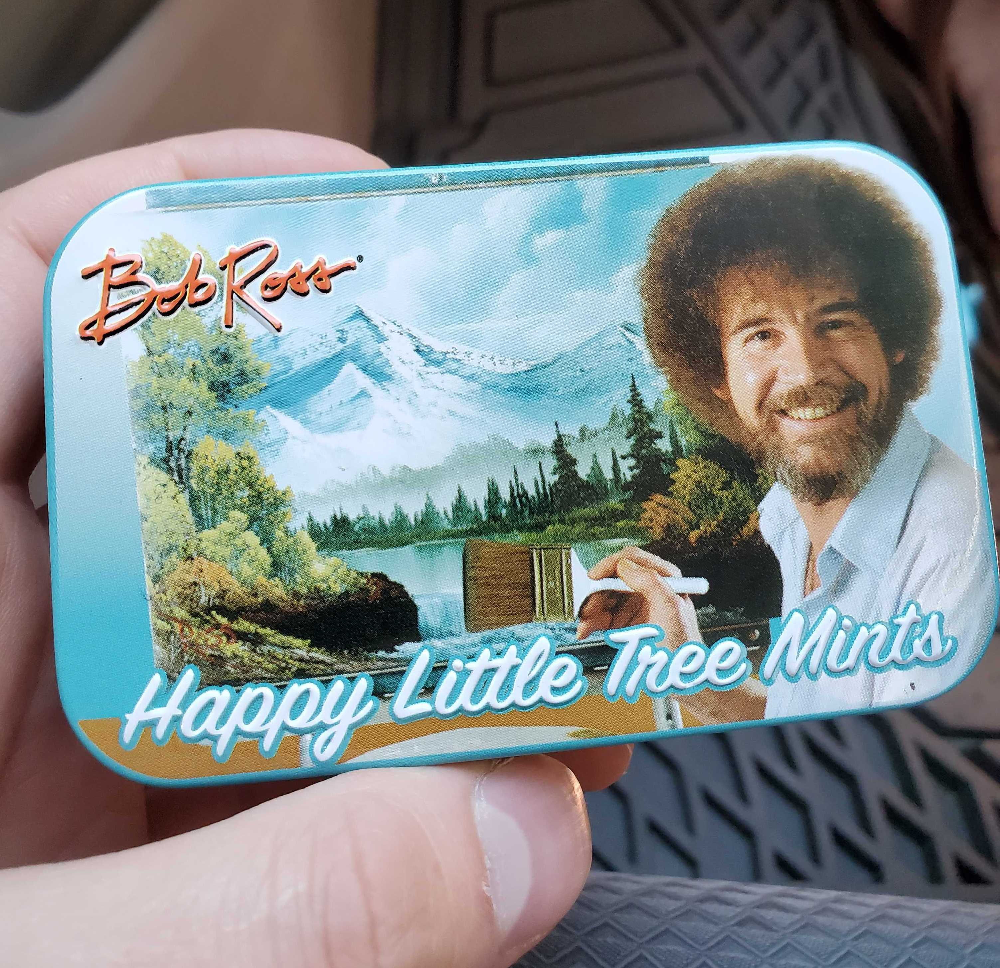

Hand sanitizer - delivered

   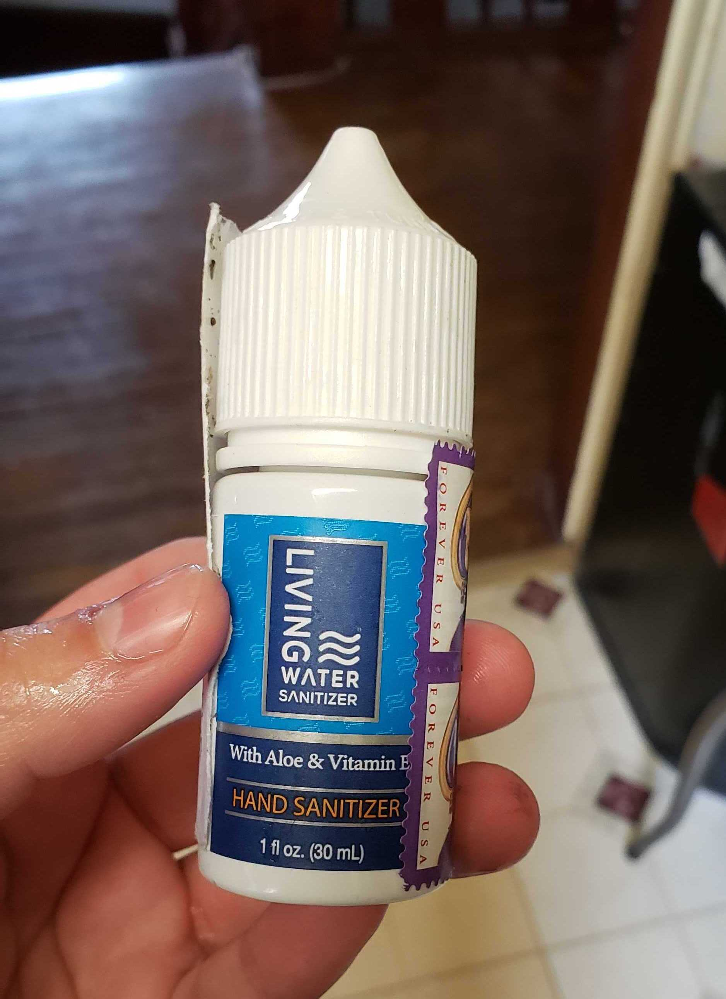

Bonne Maman jam lid - not delivered

Anticannibalism bracelet - delivered

   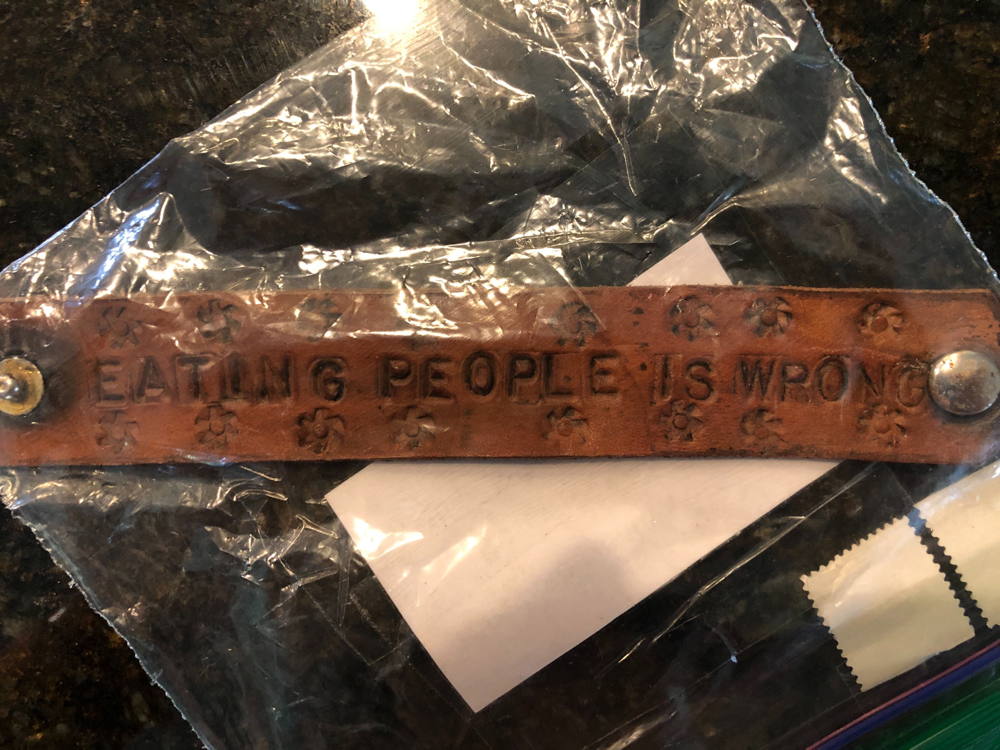

Glove - not delivered

   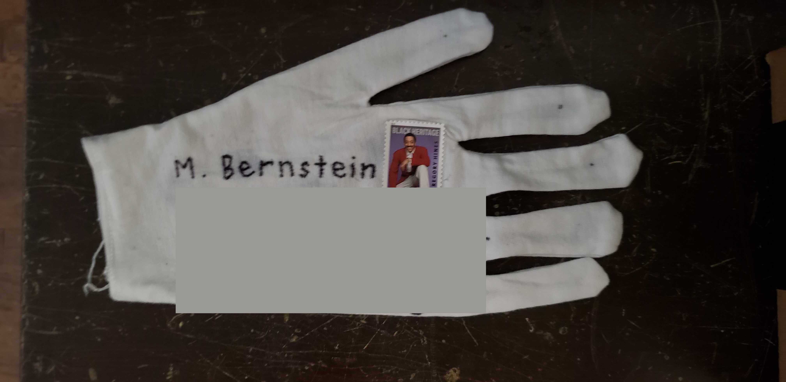

Lemon from my backyard with address and URGENT written on it in Sharpie mailed within Berkeley - delivered in a few days

   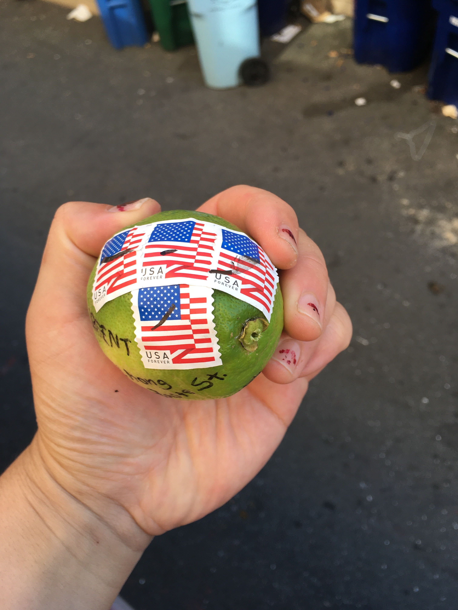

Lemon coincidentally picked from another Bay area backyard and mailed to Berkeley - delivered

   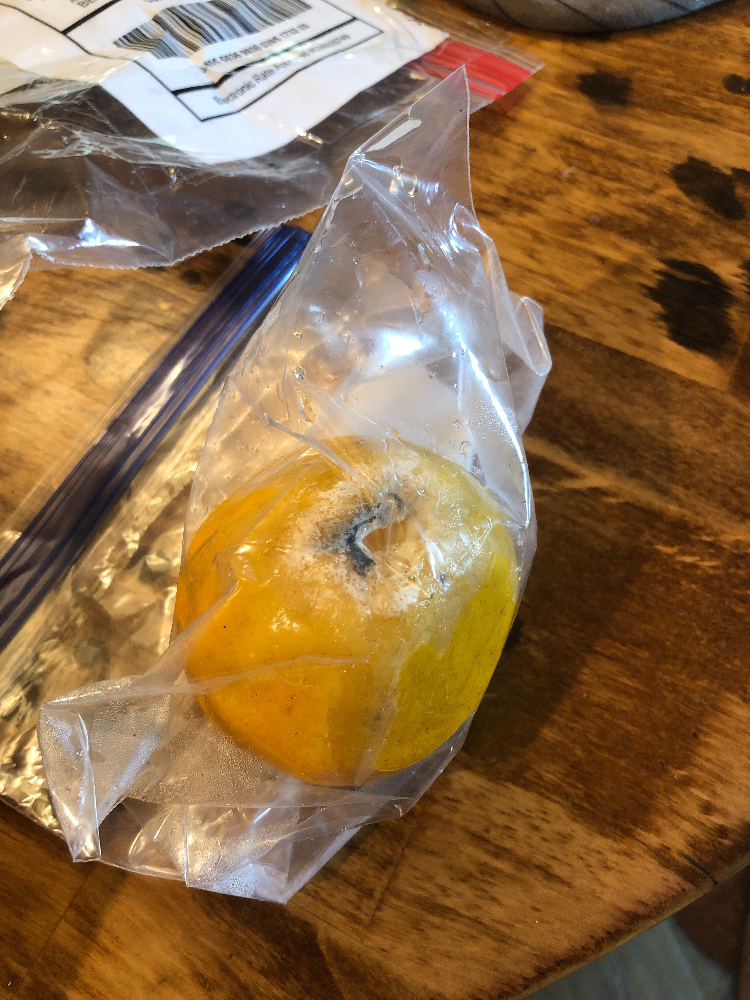

Origami box containing three origami cranes - delivered

   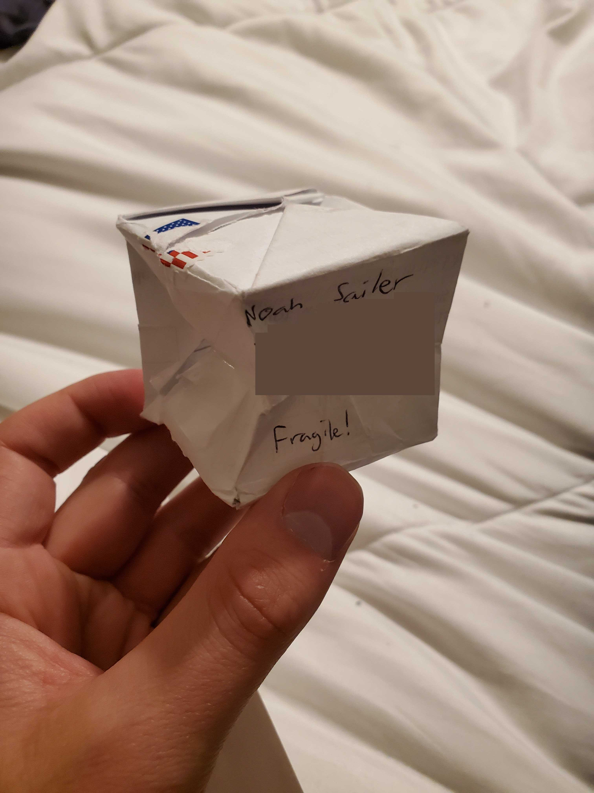
   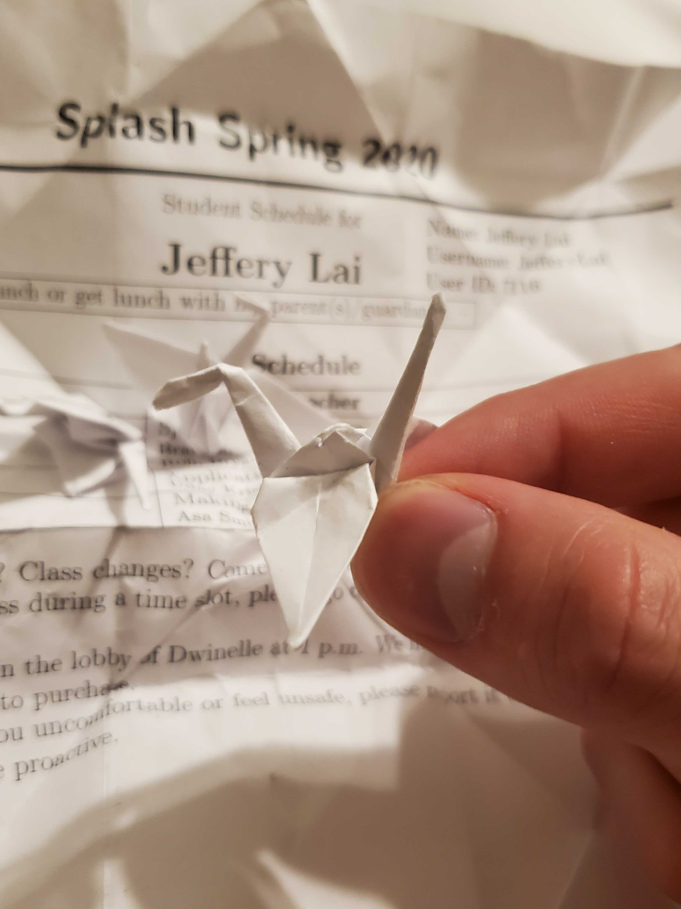

Lone stamp with address and odd message on back - not delivered

   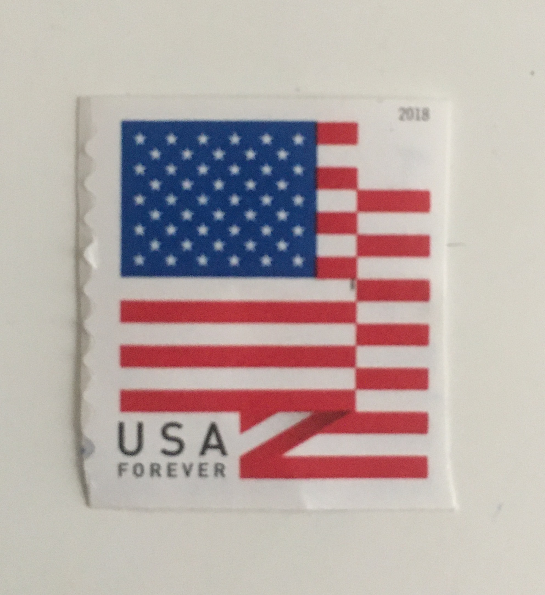
   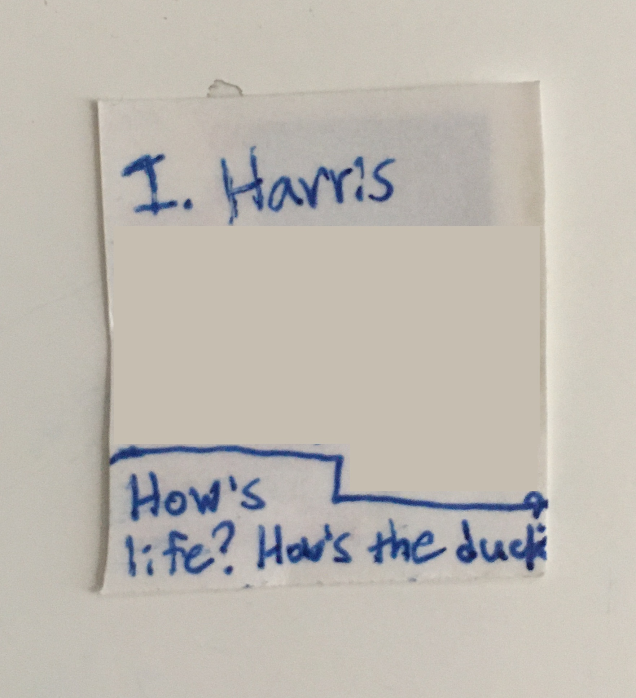

Chicago flag socks with an address and stamps sewn into one - delivered (credit to Madeline Bernstein for the quality item)

   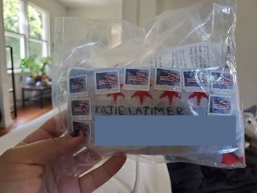

3D ball maze - delivered despite having too little postage.  As the postman collected perhaps the best $2.55 I've ever spent, he made it clear with his manner that he'd never seen something like this and wasn't going to miss the chance to make fun of it

   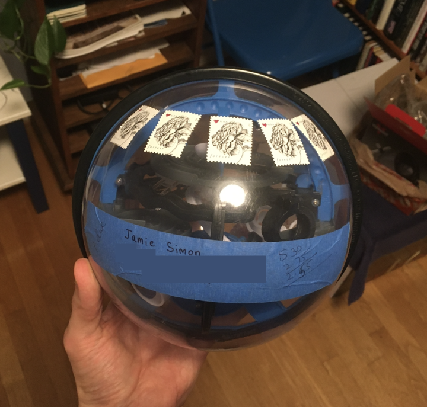

Dehydrated celery stalk partially wrapped in duct tape - not delivered

There are a few clear conclusions we can draw from these experiments.  First, the sheer probability of the postal service delivering something weird is shockingly high.  Second, they're more likely to deliver something when it has no way to give it back to the sender - the mint box was refusable, and my single dollar had a return address, while to my knowledge nothing else in the USPS experiments had a return address.  The natural combination of these two conclusions is that the postal service will probably deliver anything weird they can't return as long as it seems important enough that they deliver it as opposed to throwing it out.  I'd bet you could mail basically anything - a leaf, a seat cushion, a balloon - if you permanently attached it to something that looks like a bill.

The USPS' experiments will continue, but I'd love to hear from anyone else who's tried pushing the envelope of the postal system.